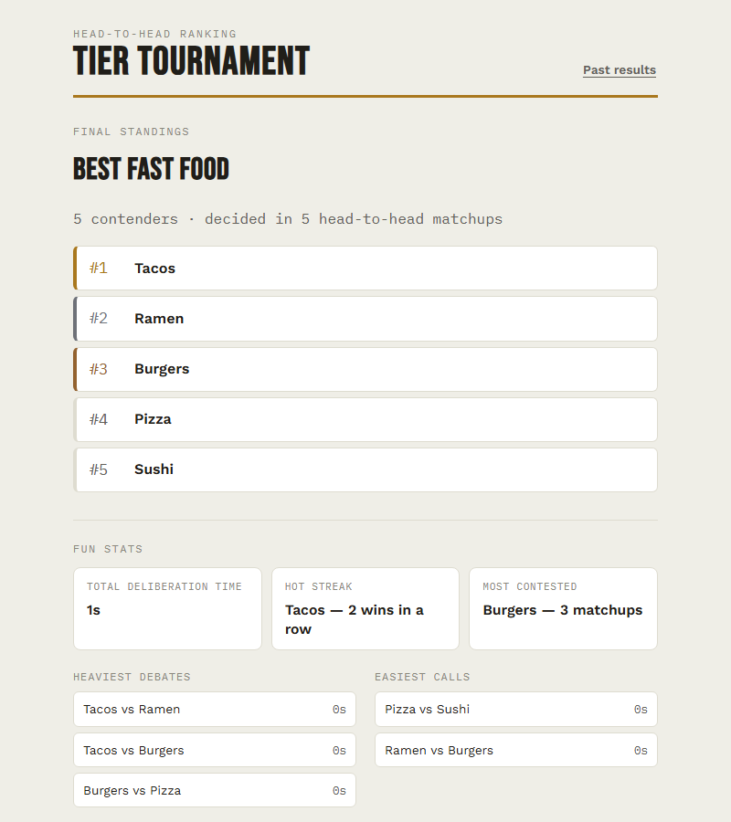

# Tier Tournament


Build a roster of anything (fruits, movies, restaurants...), then rank the
whole list by voting on head-to-head matchups. Instead of a single-elimination
bracket (which only crowns one winner) or a full round-robin (which needs
n*(n-1)/2 comparisons), this uses a merge-sort-based comparison order that
produces a complete ranking of every candidate in roughly n*log2(n) matchups.

Runs entirely on your own machine — no account, no hosting, nothing leaves
your computer. Data is stored locally in `data/tournaments.db` (SQLite).



## Quick start

Requires **Python 3.9+**. Nothing else to install ahead of time — no Node,
no database server, no build step.

```bash
git clone https://github.com/shanekdang/tier-tournament.git
cd tier-tournament
pip install -r requirements.txt
python app.py
```

Then open **http://127.0.0.1:5000** in your browser. That's it.

Don't want to use git? Click **Code → Download ZIP** on the GitHub page,
unzip it, and run the same two commands from inside the folder.

To stop the app, press `Ctrl+C` in the terminal it's running in.

## How it works

1. **Setup** — name a category and add contenders (one at a time, or paste a
   whole list).
2. **Tournament** — vote on each matchup: red corner, blue corner, or "too
   close to call." Progress is saved after every vote, so closing the tab
   mid-tournament is safe — reopen the page and you'll be offered a **Resume**.
3. **Results** — a numbered ranking of everyone, medal-marked top 3, ties
   called out, plus fun stats (heaviest debates, hot streaks). Copy the
   standings as text or download them as a PDF. Past tournaments are kept
   under **History**.

## Project layout

```
app.py            Flask routes / JSON API
tournament.py      Core ranking engine (no framework dependency — plain
                    data + advance()/vote(), easy to unit test on its own)
storage.py          SQLite persistence
stats.py             "Fun stats" (heaviest debates, streaks, etc.)
templates/index.html  Page shell
static/style.css      Styling
static/app.js         Frontend logic (talks to the API via fetch)
data/                 SQLite database lives here (gitignored)
```

## Troubleshooting

- **`pip install` fails / `python` not found** — make sure Python 3.9+ is on
  your `PATH` (`python --version`). On some systems the command is `python3`
  and `pip3` instead.
- **Port 5000 already in use** — another app is using it (on macOS this is
  often AirPlay Receiver). Either stop that process, or run
  `flask run --port 5001` / edit the port in `app.py`'s `app.run(...)` call.
- **Want to start over with a clean slate** — delete `data/tournaments.db`
  while the app isn't running; it's recreated automatically on next launch.

## Extending it later

Some natural next steps, since this is meant to grow:
- Swap the "one shared device" flow for remote voting (each friend opens the
  page on their own phone and the group's votes get combined).
- Group results into S/A/B/C tiers instead of a strict numbered list.
- Add authentication if this ever needs to run somewhere other than your
  own machine.

## License

[MIT](LICENSE) — do whatever you'd like with it.
